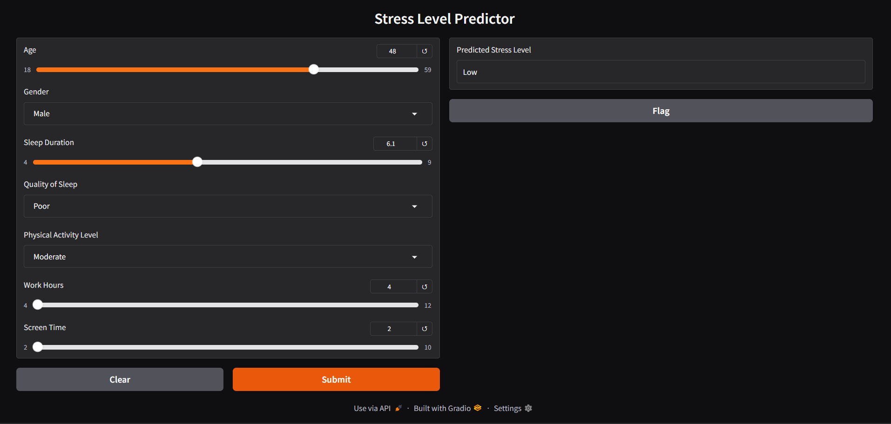
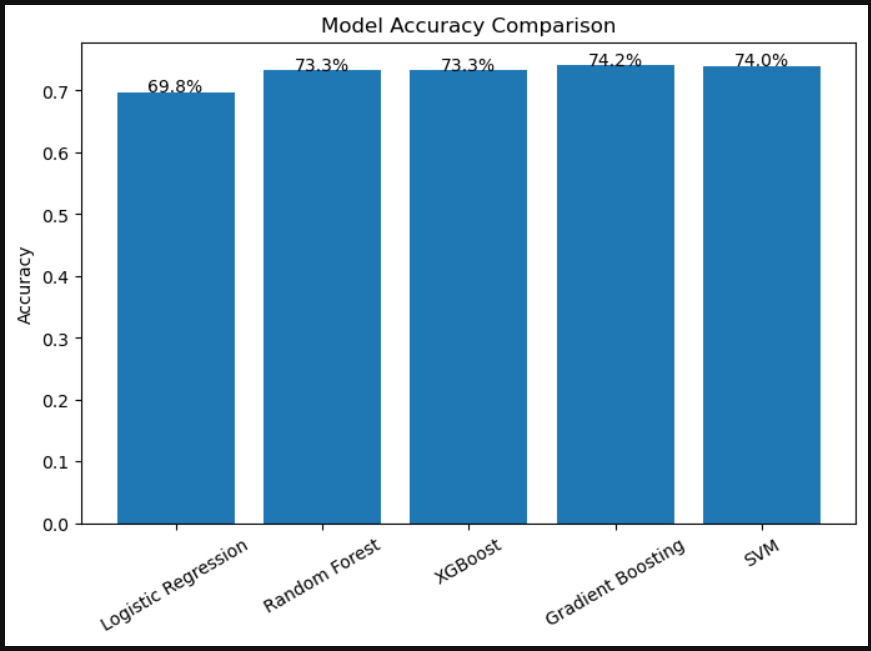
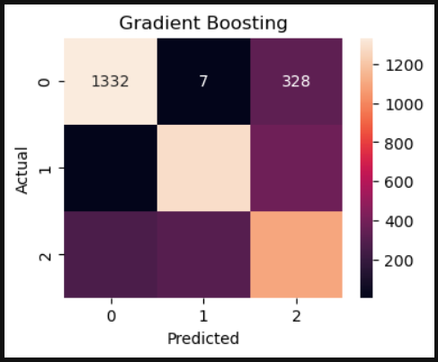
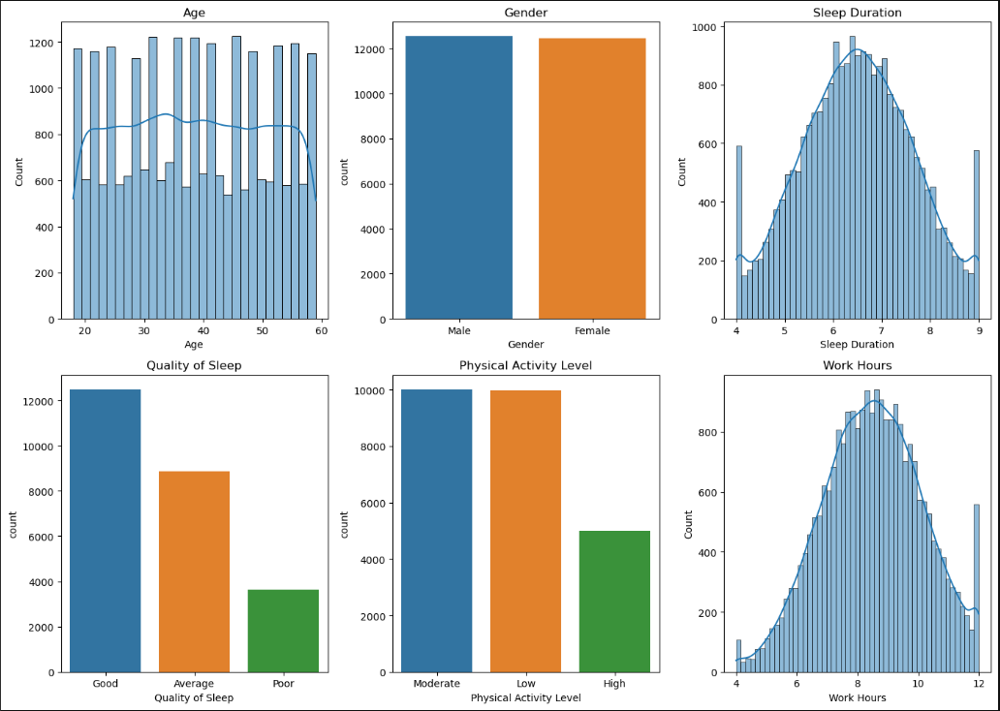

# # 🧠 Predicting Human Stress Levels Through Behavioral and Digital Activity

📊 Machine learning project to classify human stress levels (Low / Medium / High) using behavioral and digital activity data.

---

## 📸 Model / UI Preview

  

---

## 📊 Model Accuracy Comparison

  

---

## 🔥 Confusion Matrix (Best Model - GradientBoostingClassifier)

  

---

## 📊 Exploratory Data Analysis

  

---

## 🎯 Objective

- Predict stress levels (Low / Medium / High)
- Compare multiple machine learning models
- Identify the most accurate model

---

## 📊 Dataset

- 25,450 records  
- 8 features  
- Balanced dataset  

### Features:
- Age  
- Gender  
- Sleep Duration  
- Quality of Sleep  
- Physical Activity Level  
- Work Hours  
- Screen Time  

---

## ⚙️ Workflow

1. Data Cleaning  
2. Exploratory Data Analysis (EDA)  
3. Encoding & Scaling  
4. Train-Test Split  
5. Model Training  
6. Model Evaluation  
7. Deployment using Gradio  

---

## 🤖 Models Used

- Logistic Regression  
- Random Forest  
- Gradient Boosting  
- Support Vector Machine (SVM)  

---

## 📈 Results

- Random Forest → 73.06%
- 🏆 Gradient Boosting → 74.16%  (Best Model)
- Logistic Regression → 69.87%  
- SVM → 74.02%  

---

## 🔍 Key Insights

- Sleep duration is a strong predictor of stress  
- High screen time correlates with increased stress  
- Work hours significantly influence stress levels  

---

## 🚀 Deployment

- Model saved using `pickle`  
- Interactive UI built with **Gradio**  

---

## 📎 Project Files

- 📊 ML Code → `.ipynb / .py`  
- 📁 Dataset → `.csv`  
- 🤖 Model Files → `.pkl`  
- 🖼️ Screenshots → UI, Accuracy, Confusion Matrix, EDA  
- 📄 Presentation → PPT  

---

## 👤 Author

**Rakesh Nath S**  
Aspiring Data Analyst | Machine Learning | Python | SQL | Power BI | Tableau
